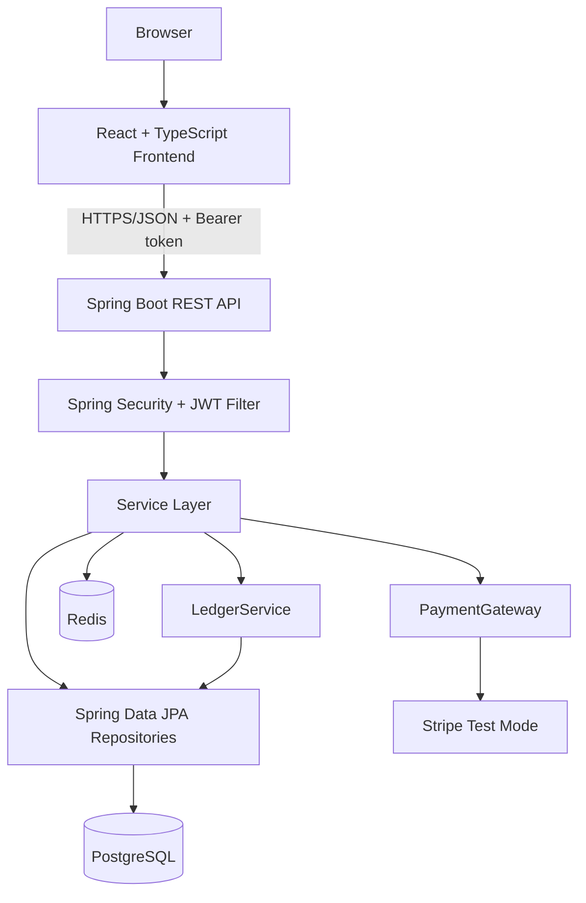

# Chapter 1: Project Overview

## What Problem This Project Solves

This project is a simulated full-stack banking platform. It lets a customer register, sign in, complete a profile, open accounts, deposit and withdraw money, transfer money to another account, save beneficiaries, issue virtual cards, make card purchases, top up an account through a payment gateway, apply for loans, repay installments, and let an admin verify KYC or approve/reject loans.

The word "simulated" matters. The application behaves like a bank from a software-engineering perspective, but it does not move real money and it is not a regulated financial institution. That makes it ideal for learning: the project can teach banking correctness, security, transactions, and architecture without legal or financial risk.

## Real-World Use Case

Imagine a small digital bank prototype. A customer signs up, proves identity through a KYC workflow, opens a checking account, adds money, sends money to another customer, uses a virtual card for purchases, and borrows through an installment loan. An administrator reviews customers and loan requests.

The project is also useful as a resume-grade engineering sample because it demonstrates several high-value ideas:

| Capability | Why it matters in real software |
|---|---|
| Double-entry ledger | Money movement must balance. You cannot rely on ad hoc balance edits. |
| JWT access tokens plus rotating refresh tokens | Modern stateless authentication with revocation support. |
| PostgreSQL transactions and locks | Prevents race conditions when balances change. |
| Flyway migrations | Database schema is versioned like code. |
| React Query | Frontend server state is cached and invalidated intentionally. |
| Integration tests with Testcontainers | Tests use a real PostgreSQL database instead of pretending with mocks. |
| Docker Compose | Local infrastructure is reproducible. |

## Users

| User | Goals | Main Screens or APIs |
|---|---|---|
| Customer | Register, sign in, open accounts, view balances, transfer funds, manage cards, apply for loans | Signup, Login, Dashboard, Account Detail, Transfer, Cards, Loans, Profile |
| Admin | Review customer KYC status, approve or reject loans | Admin page, admin user APIs, admin loan APIs |
| Developer | Run the stack locally, test it, understand and extend the system | README, Maven, npm, Docker Compose, Swagger/OpenAPI |
| CI runner | Prove the project builds on clean machines | GitHub Actions workflow |

## Functional Requirements

A functional requirement says what the system must do.

| Area | Requirement |
|---|---|
| Authentication | Register, login, refresh tokens, logout, protect private routes. |
| User profile | Store KYC profile fields and admin-verifiable status. |
| Accounts | Create checking/savings accounts, list accounts, fetch one account. |
| Ledger | Record every money movement as balanced debit/credit entries. |
| Deposits/withdrawals | Add or remove money using the system settlement account as counterparty. |
| Transfers | Move money between customer accounts atomically. |
| Beneficiaries | Save and remove destination accounts for future transfers. |
| Cards | Issue, freeze, unfreeze, cancel, and charge virtual cards. |
| Payments | Create and settle top-ups using simulated or Stripe-backed gateway code. |
| Loans | Apply for loans, approve/reject as admin, generate amortization schedules, repay installments. |
| Admin | List customer profiles and update KYC status. |

## Non-Functional Requirements

A non-functional requirement says how well the system must behave.

| Quality | Requirement | Where it appears |
|---|---|---|
| Correctness | Money movement must be balanced and atomic. | `LedgerService`, PostgreSQL transactions, integration tests |
| Security | Private APIs require valid JWTs; admin routes require admin role. | `SecurityConfig`, `JwtAuthenticationFilter`, `@PreAuthorize` |
| Consistency | Concurrent account updates must not corrupt balances. | `findForUpdate`, `@Transactional`, deterministic account locking |
| Reproducibility | A new developer can run the same stack. | Docker Compose, Maven wrapper, npm lockfile |
| Evolvability | Domains are separated by package. | `auth`, `account`, `ledger`, `transfer`, `card`, `payment`, `loan` packages |
| Observability | Health and metrics endpoints exist. | Spring Actuator configuration |
| Documentation | APIs are discoverable. | springdoc/OpenAPI and README tables |

## High-Level Architecture



The architecture is a modular monolith. That means one backend deployable contains multiple domain modules. It is not a microservice system, but it is organized so future extraction would be possible.

> Industry Note: Many production systems start as modular monoliths because they are simpler to test, deploy, and debug. Microservices are valuable when organizational scale or independent deployment becomes worth the network and operations cost.

## Complete Technology Stack

| Layer | Technology | Why chosen | Alternative |
|---|---|---|---|
| Backend language | Java 21 | Mature type system, strong ecosystem, modern language features | Kotlin, C#, Go |
| Backend framework | Spring Boot 3.5 | Fast REST/JPA/security setup with production conventions | Micronaut, Quarkus, Jakarta EE |
| Persistence | PostgreSQL | ACID transactions and numeric precision for money | MySQL, CockroachDB |
| ORM | Spring Data JPA/Hibernate | Entity mapping and repository abstraction | jOOQ, MyBatis, raw JDBC |
| Migrations | Flyway | Versioned database changes | Liquibase |
| Cache/token store | Redis | Fast TTL-backed refresh token storage | Database table, in-memory cache |
| Security | Spring Security + JWT + BCrypt | Standard stateless API security | OAuth provider, sessions |
| API docs | springdoc/OpenAPI | Generates Swagger UI from controllers | Handwritten OpenAPI |
| Frontend | React 19 + TypeScript | Component model plus compile-time safety | Vue, Angular, Svelte |
| Frontend build | Vite | Fast dev server and bundling | Webpack, Parcel |
| Server state | TanStack Query | Caching, loading states, invalidation | Redux Toolkit Query, SWR |
| HTTP client | Axios | Request/response interceptors for auth refresh | fetch wrapper |
| Styling | Tailwind CSS | Utility-first styling with small CSS surface | CSS Modules, Material UI |
| Local infra | Docker Compose | Reproducible Postgres/Redis containers | Local installs, Kubernetes |
| Tests | JUnit, MockMvc, Testcontainers | Realistic backend verification | Mockito-heavy unit tests only |

## Folder Structure Overview

```text
BankingSystem/
├── backend/             Spring Boot backend
├── frontend/            React/Vite frontend
├── .github/workflows/   Continuous integration
├── docker-compose.yml   Local infrastructure
├── README.md            Human starting point
└── PROJECT_PLAN.md      Architecture roadmap and phase plan
```

## Analogy

Think of the backend as a bank branch. Controllers are tellers who accept forms. Services are department managers who know the rules. Repositories are filing clerks who read and write official records. The ledger is the accounting office: no money movement is official until accounting records both sides.

## Things Beginners Usually Do Not Understand

- A balance is not the source of truth by itself. The ledger explains how that balance happened.
- `BigDecimal` is used because floating-point numbers can introduce rounding errors.
- A JWT access token is intentionally short-lived; the refresh token is the longer-lived credential.
- A repository method can trigger real SQL even though it looks like a normal Java method call.
- React Query stores server data separately from component-local form state.

## Common Mistakes

- Updating account balances directly from many services instead of routing all money movement through one ledger service.
- Storing raw card numbers instead of returning the PAN once and retaining only last four digits.
- Letting every frontend component create its own Axios client, which scatters auth behavior.
- Treating migrations as optional after the project starts using a real database.

## Exercises

1. Trace a deposit request from the dashboard to the database tables it changes.
2. Explain why a transfer has two ledger entries but one transaction row.
3. Add a new transaction type on paper and list every file that would need attention.
4. Compare a modular monolith and microservice design for this exact app.

## Quiz

| Question | Answer |
|---|---|
| Why does the project need Redis? | To store opaque refresh tokens with TTL and support revocation/rotation. |
| Why is `open-in-view` disabled? | To avoid lazy database access during view serialization and keep transaction boundaries explicit. |
| What prevents double-spending during a retry? | Idempotency keys plus transaction lookup before posting again. |
| Why does the system account exist? | It provides a counterparty for external money in/out so ledger entries balance. |
