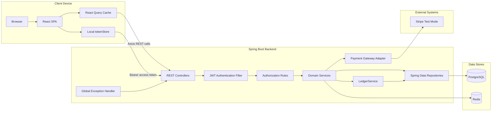
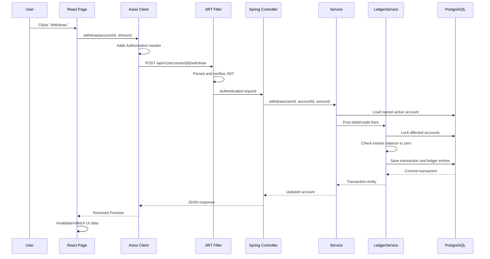
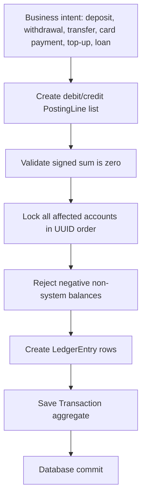

# Chapter 2: Project Architecture

## Complete Architecture

## Every Connection Explained

| Connection | What travels across it | Why it exists | If removed |
|---|---|---|---|
| Browser -> React SPA | HTML, JS, CSS, static assets | Gives users an interactive banking UI | Users would need raw API clients |
| React -> Axios API modules | Function calls and typed payloads | Centralizes HTTP details | API logic would be duplicated across pages |
| Axios -> Spring controllers | JSON over HTTP with optional Bearer token | Clean network boundary between UI and backend | No frontend/backend integration |
| Controller -> JWT filter | Servlet request | Authenticates protected requests before business code | Private APIs become unsafe or always fail |
| Controller -> service | Java method calls and validated DTOs | Keeps controllers thin and business rules reusable | HTTP layer would become business layer |
| Service -> repository | Entity queries and saves | Encapsulates database access | Services would write SQL or persistence code directly |
| Service -> LedgerService | Posting lines | Forces all money movement through one invariant checker | Balance changes become scattered and risky |
| Repository -> PostgreSQL | SQL generated by Hibernate | Durable ACID storage | User/account/money state disappears after restart |
| RefreshTokenService -> Redis | `refresh:<token>` keys with TTL | Revocable rotating refresh tokens | Logout/rotation becomes harder with pure stateless JWTs |
| PaymentService -> PaymentGateway | Payment intent creation and settlement callbacks | Decouples app logic from Stripe/simulation details | Payment logic becomes provider-specific everywhere |

## Browser to Database Request Flow

## Why Modular Monolith

This codebase uses domain packages instead of separate deployable services. The benefits are direct:

- One deployment unit is easy for a student or solo developer to run.
- One database transaction can safely update accounts, transactions, ledger entries, payments, and loans.
- Refactoring across domains is cheap because there is no network contract between internal modules.
- Package boundaries still teach good architecture.

Alternatives:

| Alternative | Benefit | Cost in this project |
|---|---|---|
| Microservices | Independent deployment and scaling | Distributed transactions, service discovery, network failure, more DevOps |
| Single flat package | Fast at first | Becomes unreadable as domains grow |
| Event-sourced system | Excellent audit trail | More conceptual and infrastructure complexity for a learning project |

## Core Design Decision: One Ledger Gate

Every money movement is converted into posting lines and sent through `LedgerService.post`. That service validates the sum, locks accounts, checks negative balances, updates materialized balances, and persists immutable ledger entries.

## Compile-Time vs Runtime Behavior

| Concern | Compile time | Runtime |
|---|---|---|
| Java classes | Maven/Java compiler verifies syntax and types | JVM loads bytecode and Spring creates beans |
| TypeScript | Type checker verifies route/page/API types | Types are erased and browser runs JavaScript |
| JPA entities | Annotations compile as metadata | Hibernate maps objects to SQL tables |
| Spring controllers | Annotations compile as metadata | Spring maps HTTP requests to methods |
| React JSX | TypeScript/Vite transforms JSX | React creates elements and reconciles DOM |

## Interview Questions

1. Why does this app use one backend instead of microservices?
2. What invariant does `LedgerService` protect?
3. Where are authentication and authorization separated?
4. Why are repositories interfaces rather than concrete classes?
5. What would break if Redis were unavailable?
