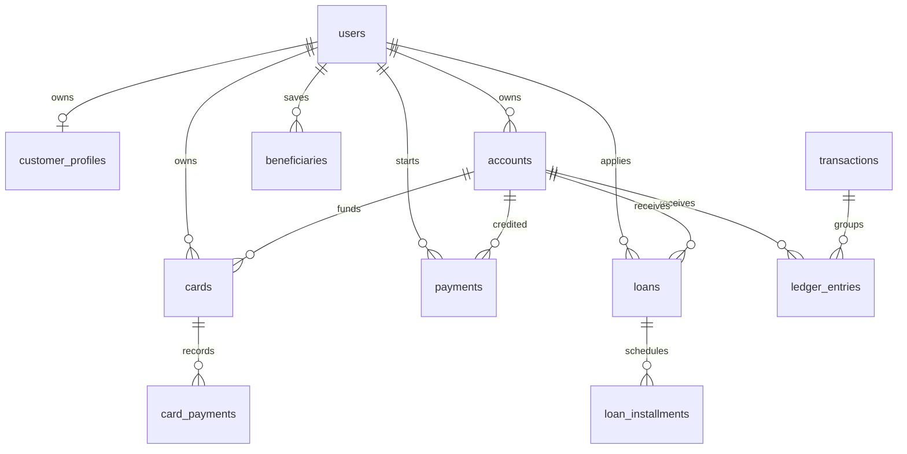
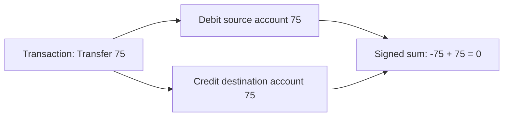
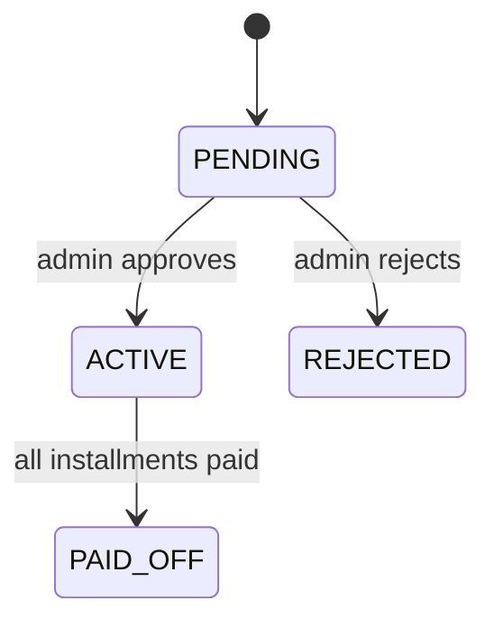

# Chapter 5: Domain Model and Database

## Entity Relationship Overview

## Users and Customer Profiles

`users` stores login identity: email, password hash, role, enabled flag, timestamps, and optimistic-lock version. `customer_profiles` stores KYC information. Splitting these concepts is deliberate: admins and support accounts may have identity without customer KYC profile data.

If KYC fields were stored directly on `users`, staff accounts would carry irrelevant nullable fields and the identity table would become less focused.

## Accounts

`accounts` stores account number, owner, type, currency, materialized balance, status, timestamps, and version.

The balance column is materialized for fast display. The ledger remains the explanation of every movement. In production, teams often reconcile materialized balances against ledger entries.

## Transactions and Ledger Entries

A `Transaction` is the business event: deposit, withdrawal, transfer, top-up, card payment, loan disbursement, or loan repayment.

A `LedgerEntry` is one side of the accounting event. Each transaction must have at least two entries, and the signed sum must be zero.

## Why Debit and Credit Are Modeled Explicitly

Beginners often ask: why not just store `amount = -75` or `amount = 75`? Explicit `EntryDirection` is clearer and closer to accounting language. It makes database constraints easier and prevents negative amounts from sneaking into the `amount` column.

## Cards and Payments

Cards store only last four digits, brand, expiry, status, monthly limit, and account/user IDs. The project returns the generated PAN once during issuance and then forgets it. This models tokenization behavior: the app does not become a vault for raw card numbers.

Payments represent account top-ups. The payment gateway creates a provider reference. Fulfillment posts a top-up transaction through the ledger and marks the payment succeeded.

## Loans and Installments

A loan starts pending. Admin approval generates an amortization schedule and disburses principal into the customer's account. Repayment pays the next unpaid installment and eventually marks the loan paid off.

## Migration Strategy

The Flyway files are ordered by phase:

| Migration | Adds |
|---|---|
| `V1__baseline.sql` | Platform metadata baseline |
| `V2__auth_users.sql` | Users and customer profiles |
| `V3__accounts_ledger.sql` | Accounts, transactions, ledger entries, system account |
| `V4__beneficiaries.sql` | Saved payees |
| `V5__cards_payments.sql` | Cards, card payments, top-up payments, new transaction types |
| `V6__loans.sql` | Loans, installments, loan transaction types |

## What Happens If Database Constraints Are Removed

| Constraint | Risk if removed |
|---|---|
| Unique email | Two users could share login identity. |
| Ledger amount positive | Negative amounts could invert accounting semantics. |
| Enum check constraints | Invalid statuses/types could appear and crash application code. |
| Foreign keys | Orphan rows would break joins and ownership checks. |
| Unique idempotency key | A retry could create duplicate transactions. |

## Exercise

Write the ledger rows for a customer top-up of 100 USD. Which account is credited? Which account is debited? Why does the sum equal zero?
