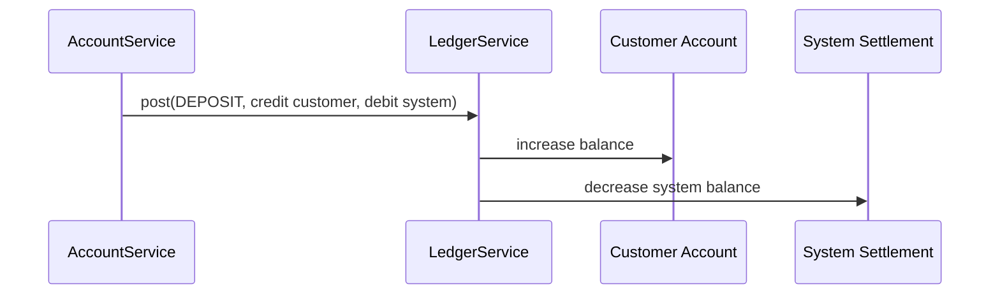
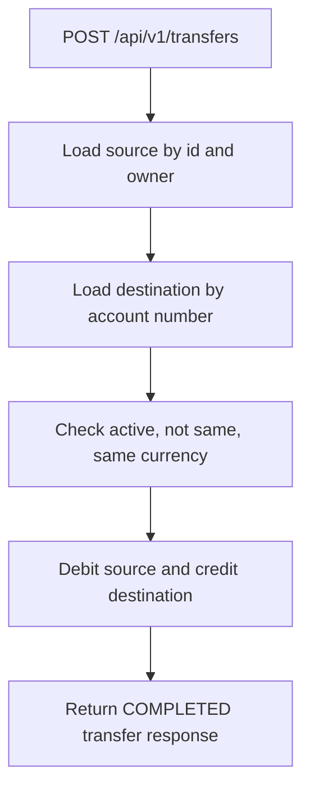
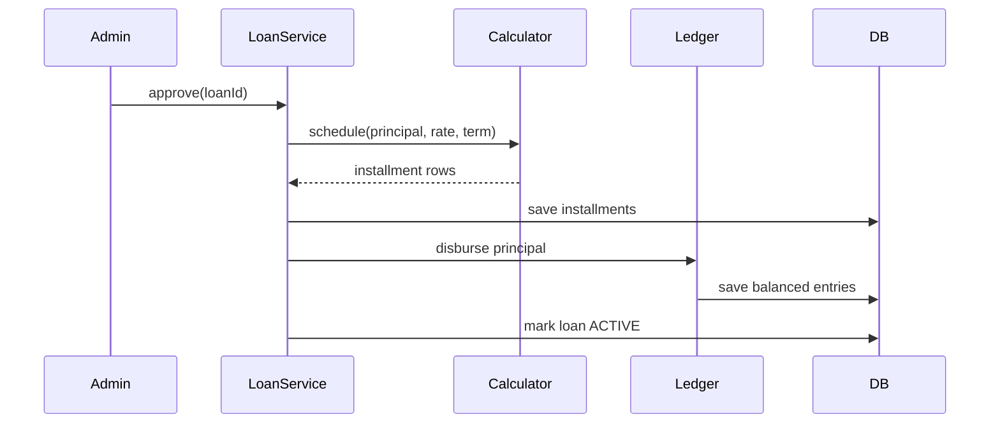

# Chapter 6: Money Movement Flows

## The Single Rule

No feature is allowed to "just set a balance". Every feature creates posting lines and calls `LedgerService.post`.

That rule solves three problems at once:

1. It centralizes insufficient-funds checks.
2. It makes transactions auditable.
3. It prevents each feature from inventing its own money logic.

## `PostingLine`

A posting line contains an account id, a direction, and an amount. It exposes helper constructors for credit/debit and a signed amount used for balance math.

The signed amount is where project accounting policy appears: credits increase customer account balance and debits decrease it. The system settlement account is allowed to go negative because it represents the outside world in this simplified model.

## `LedgerService.post` Algorithm

```text
Input: transaction type, description, optional idempotency key, posting lines
1. If an idempotency key exists, return the existing transaction if found.
2. Validate that at least two lines exist.
3. Convert every line to a signed amount and ensure the sum is zero.
4. Collect affected account ids.
5. Sort ids so locks are acquired in deterministic order.
6. Load every account with a pessimistic write lock.
7. For each line, calculate the new balance.
8. Reject negative balances for non-system accounts.
9. Create ledger entries with balanceAfter.
10. Save the transaction aggregate.
```

Time complexity is O(n log n) for n posting lines because account IDs are sorted before locking. In practice n is tiny: most movements have two entries.

## Deposit



A deposit brings outside money into the bank. The customer account is credited. The system settlement account is debited so the ledger balances.

## Withdrawal

A withdrawal reverses the deposit direction: debit customer, credit system. If the customer's new balance would be negative, the ledger throws `InsufficientFundsException`.

## Transfer

A transfer does not touch the system account. It debits the source and credits the destination. The transfer service also checks ownership, active status, same-currency constraint, destination existence, and self-transfer rejection.



## Idempotency

The frontend sends a fresh `Idempotency-Key` per transfer submission. If the network fails after the server commits but before the browser receives the response, retrying with the same key returns the existing transaction instead of posting again.

This is a professional payment-system pattern.

## Card Payment

A card payment checks that the card and account are active, enforces monthly limit, then debits the account and credits the system account. This models money leaving the bank to pay a merchant.

The card PAN generation uses the Luhn algorithm. Luhn catches many accidental digit errors and makes generated test card numbers realistic.

## Top-Up

Top-up starts as a `Payment` row with a provider reference. Settlement calls `PaymentService.fulfill`, which is idempotent in two ways:

- It returns early if the payment already succeeded.
- It uses the provider reference as the ledger idempotency key.

## Loan Approval and Repayment

Loan approval does two things in one transaction: generate installments and disburse principal. Repayment debits the customer's account for the next unpaid installment and credits the system account.



## Common Mistakes

- Forgetting to acquire locks before changing balances.
- Using `double` for money.
- Making idempotency optional for retry-prone operations.
- Updating loan status before the disbursement has successfully posted.

## Interview Questions

1. Why does the system settlement account exist?
2. How does deterministic lock ordering reduce deadlock risk?
3. Why is an idempotency key stored on `transactions` instead of only in memory?
4. What should happen if a card payment succeeds in the database but the browser disconnects?
