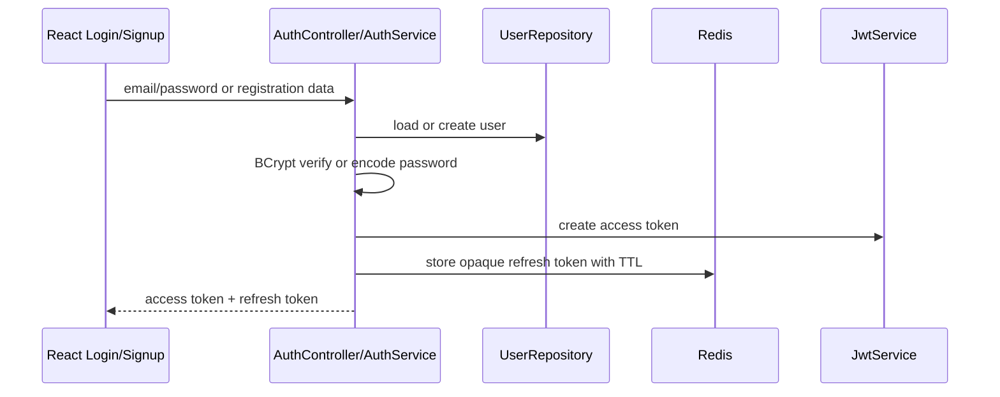

# Chapter 7: Auth, Security, and User Management

## Authentication Flow

## Access Tokens

The access token is a signed JWT. It contains subject user id, issuer, email, role, issue time, and expiration. The server does not store access tokens. It verifies signature and expiry on each request.

Why short-lived? If stolen, the damage window is limited.

## Refresh Tokens

Refresh tokens are opaque UUID strings stored in Redis. Opaque means the token itself does not describe the user; Redis maps token to user id.

On refresh, the service revokes the presented token and issues a new pair. That is token rotation. It reduces the value of stolen refresh tokens because reuse becomes detectable/limited.

## Authorization

`SecurityConfig` requires authentication for most endpoints. Admin-specific controllers use method security such as `@PreAuthorize("hasRole('ADMIN')")`.

Authentication answers: who are you?
Authorization answers: are you allowed to do this?

## Customer Profile and KYC

Registration creates both a `User` and a `CustomerProfile`. KYC status starts pending. Admins can set KYC to verified or rejected. Loan applications require verified KYC.

This models a real banking rule: lending and regulated account behavior often require identity verification.

## Password Handling

Passwords are never stored directly. `AuthService.register` calls `passwordEncoder.encode`, and login calls `passwordEncoder.matches`. BCrypt stores salt and cost factor in the hash string.

If plain passwords were stored, a database leak would expose customer credentials immediately.

## Security Common Mistakes

- Putting JWT secrets in source code for production.
- Making refresh tokens JWTs without a revocation plan.
- Trusting frontend role checks instead of enforcing admin role on the backend.
- Returning different login errors for "email not found" vs "bad password", which helps attackers enumerate users.

## Exercise

Trace what happens when an expired access token causes a frontend request to receive 401. Which file retries the request? Which endpoint gets called? What happens if refresh also fails?
