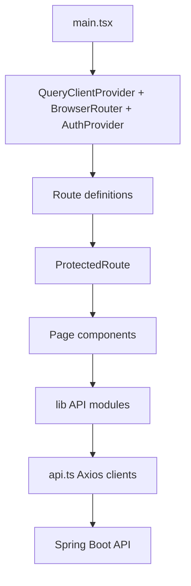

# Chapter 8: Frontend Application

## Frontend Architecture

## Entry Point

`main.tsx` creates a React root, wraps the app in providers, and declares routes. Providers are important because pages need shared capabilities:

| Provider | Gives |
|---|---|
| `QueryClientProvider` | Query cache, mutation state, invalidation |
| `BrowserRouter` | URL-based navigation |
| `AuthProvider` | Current user, loading state, login/register/logout actions |

## Auth Context

`AuthContext.tsx` stores `user` and `loading`, loads the current profile if an access token exists, and exposes login/register/logout actions.

It deliberately does not own every piece of app data. Accounts, cards, loans, and transfers are server state, so React Query handles them at the page level.

## Axios Client

`api.ts` creates two clients:

| Client | Why |
|---|---|
| `api` | Authenticated calls. Adds Bearer token and retries once after refresh. |
| `authClient` | Token endpoints. Avoids interceptor loops while refreshing. |

The `refreshing` Promise variable prevents multiple simultaneous 401 responses from sending multiple refresh requests. They share one in-flight refresh.

## Pages

| Page | Workflow |
|---|---|
| `LoginPage` | Existing user authentication |
| `SignupPage` | New user registration |
| `DashboardPage` | List/open accounts and show total balance |
| `AccountDetailPage` | Deposits, withdrawals, transaction history, top-up |
| `TransferPage` | Send money and manage beneficiaries |
| `CardsPage` | Issue cards, freeze/unfreeze/cancel, pay merchant |
| `LoansPage` | Apply, view schedule, repay, admin approve/reject |
| `ProfilePage` | Update KYC profile fields |
| `AdminPage` | Admin user KYC management |

## Why React Query

Without React Query, every page would need manual `useEffect`, loading booleans, error booleans, cache resets, and refetch logic. React Query standardizes that pattern.

Example: after creating an account, `DashboardPage` invalidates the `accounts` query so the visible account list refreshes from the server.

## TypeScript Value

The API modules define interfaces such as `Account`, `Loan`, and `Card`. That catches many mistakes before the browser runs:

- Accessing a field that does not exist.
- Passing the wrong argument type to an API helper.
- Forgetting that API money values are strings in several responses.

## Common Mistakes

- Storing server data only in global context and never invalidating it.
- Forgetting `replace` on login redirects, which can make back navigation awkward.
- Retrying all 401 responses forever instead of one guarded refresh attempt.
- Treating TypeScript interfaces as runtime validation. They are erased at runtime.

## Exercise

Add a new page for "Statements" on paper. List the route, nav link, API helper, query key, backend endpoint, and DTOs you would need.
