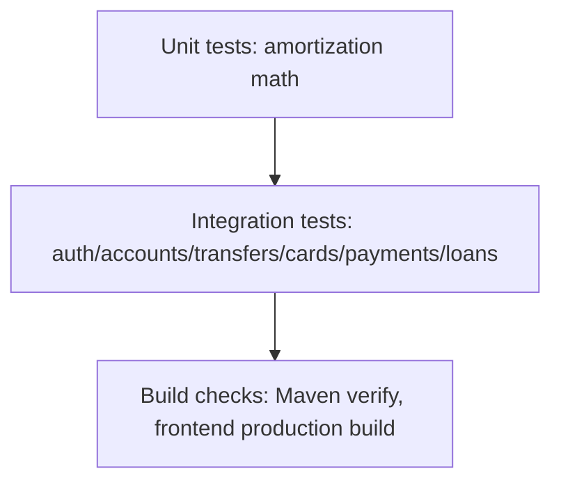
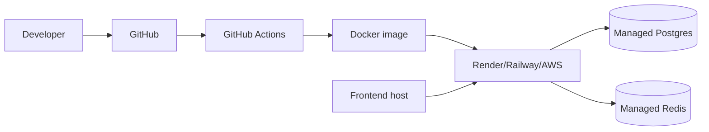

# Chapter 9: Testing, CI, and Deployment

## Testing Philosophy

The backend tests use MockMvc plus Testcontainers. That combination proves HTTP routing, JSON serialization, Spring Security, transactions, JPA mappings, Flyway migrations, and PostgreSQL behavior together.

This matters because money bugs often live in the interactions between layers.

## Test Pyramid in This Project

## Important Test Scenarios

| Test file | What it proves |
|---|---|
| `AuthFlowIntegrationTest` | Register/login/refresh/logout/admin protection |
| `AccountLedgerIntegrationTest` | Deposits, withdrawals, balance history, double-entry invariant, ownership |
| `TransferIntegrationTest` | Money movement, idempotency, insufficient funds, beneficiaries |
| `CardIntegrationTest` | Card issuance, lifecycle, payments, limits |
| `PaymentIntegrationTest` | Top-up creation and idempotent fulfillment |
| `LoanIntegrationTest` | KYC-gated applications, approval, schedules, repayment |
| `AmortizationCalculatorTest` | Loan math in isolation |
| `SmokeApplicationTests` | Spring context starts successfully |

## CI

The GitHub Actions workflow has two jobs:

1. Backend job: check out code, install JDK 21, run `./mvnw -B clean verify`.
2. Frontend job: check out code, install Node 22, run `npm ci`, run `npm run build`.

This catches both server and client regressions on a clean Linux machine.

## Docker

Docker Compose starts PostgreSQL and Redis. The backend Dockerfile builds a jar in a Maven image, then runs it in a smaller JRE image as a non-root user.

Why multi-stage? Build tools do not need to be in the runtime image.

## Deployment Path

A realistic deployment path:

## Common Mistakes

- Running only unit tests and missing migration/security failures.
- Committing `.env` secrets.
- Using local database state as proof instead of repeatable migrations.
- Running the app as root in the container.

## Exercise

Break one ledger invariant intentionally in a local branch and predict which test should fail first. Then restore it.
